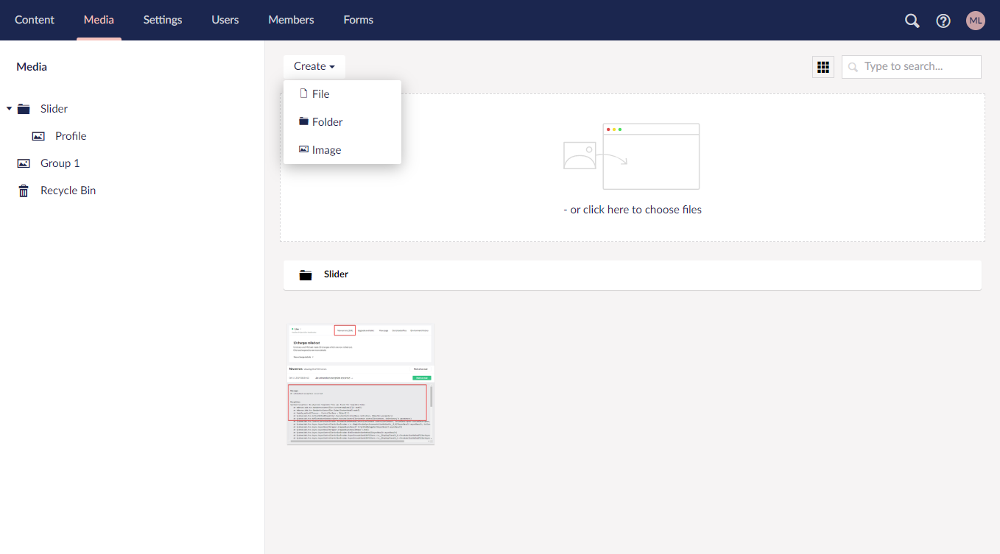

# Tour of the Backoffice

In this article you will get an introduction to the different sections in the Umbraco Backoffice.

## Login screen

When you go to the backoffice of your Umbraco Heartcore project you will be asked to log in.

From here you are able to log in with the credentials used when the project was created.

## Sections

The backoffice is divided into specific sections for example Content, Media and Settings. This will allow you to do work related to a specific section of your project.

The sections menu is located in the top-left corner of the screen.

## Section Tree

Every section has a section tree that gives you an overview of the content you have in each section.

Folders and nested content can be expanded by clicking the arrow next to the node. This can also be done by double-clicking on the node.

### Nodes

Every item you have is considered a node. It could be a media item or content in the content section.

## Dashboard

Every section in the Umbraco backoffice has one or more dashboard associated with them. The first thing you will see when accessing the backoffice on your Umbraco Heartcore project is the "Getting Started" dashboard. Here you can find links to news and resources useful to your project.

## Content

In this section you will find all the content you have on your page. Each item in the tree is called a Content Node. Every node is made up by different fields. Each field is defined by a property.

The content tree holds all the content nodes you have created.

The left holds the content tree that will automatically nest your content if you have created nodes with parent-child relationships.

On the left you can see what properties the highlighted Content Node has. In the above example there is a group called Main which holds a few properties. By clicking on the Info tap you will be able to see some useful information for the specific Content Node.

At the top you can see the automatically generated URL to the specific Content Node. Below you also get a handy history overview that shows who has done what at what time. Lastly you can see some general information such as Status, Creation Date and a direct link to the Document Type. You can edit it without leaving the current view.

Lastly you can either Save, Save and publish, Schedule a publication or unpublish the Content Node. You can change the action by clicking the small up arrow next in the green button in the lower right corner.

## Media

Media items are used to store images and videos in the Media section. These items can be referenced from your content. You are also able to create folders in the Media section to keep all your Media Items sorted.

A handy feature is that if you have a Media Picker in your Content Node and you upload an image. This image will automatically be added in the Media Section.

## Settings

In the settings section you find the before mentioned Document Types, Data Types and Media Types among other settings that will be covered below.

### Document type

Document Types defines the content nodes the editors can create in the Content section. A Document Type has a set of properties that is made up of specific Data Types like text or a numbers. A property is the fields that holds the content in a content node that can be edited by the content editor.

### Media Types

What differs from Document Types is that Media Types are specifically made for media items in the Media section.

### Member Types

When you have a website with a login you might want to create Member Types. Umbraco comes with a standard Member Type. You can extend of this, but you can also create your own type for more customized members.

### Data Type

Each Document Type property consists of a Data Type which defines what kind of input the property holds. Each Data Type references a Property Editor and can be configured in the Settings section of the Backoffice. A Property Editor can be anything from a basic number to something more complex like an image-cropper. It is possible to have multiple Data Types with different settings that still uses the same Property Editor.

### Relation Types

In this section, you can establish two-way relationships for querying both parent-to-children and children-to-parent connections.

### Log Viewer

The log viewer is a view where you can browse all log entries for your project. You can filter on warnings, errors or critical Log Types to name a few.

### Languages

In the Languages section you can manage your language variants. Depending on what plan you have chosen you will be able to setup multiple languages on your Heartcore project.

### Headless

The headless dashboard has some information about your Heartcore project. Depending on what plan you are on, you will have access to more languages and user groups.

The dashboard shows you:

* What plan you are on
* How many available languages you have
* How many user groups you have

In addition you are able to set the Content Delivery API to either Public or Private. If the API is private, you must have an [assigned API key](backoffice-users-and-api-keys.md) to fetch content from it.

From the Headless tree you can browse and explore the REST API endpoints as well as create and manage your Webhooks.

* API Browser: In the API Browser you can test your API endpoints. Learn more about this in the [API Browser article](api-browser.md).
* Webhooks: You can create and manage Webhooks for content actions. Learn more about how this is setup in the[ Webhooks article](webhooks.md).

## Users

In this section you can manage all the users that are currently working on the project. Users are not to be confused with Members. Members are people who have a login to your website's frontend. Users can be developers, content creators, and so on, who have access to the backoffice.

You can segment your users into different User Groups. You can add Users to existing Groups or create your own custom User Groups. How many of these groups you can create depends on the plan your project is on.

For each user on your project you can generate a unique API key. This key will be used to access the Content Management API, and can be revoked at any time. Learn more about the API Keys in the [Backoffice users and API keys article.](backoffice-users-and-api-keys.md)

## Members

The Members section is where you manage your members who are able to log into your projects frontend. You can create Member Groups for management if you have multiple types of memberships.

## Forms

In this section you can create and manage your Umbraco Forms.
