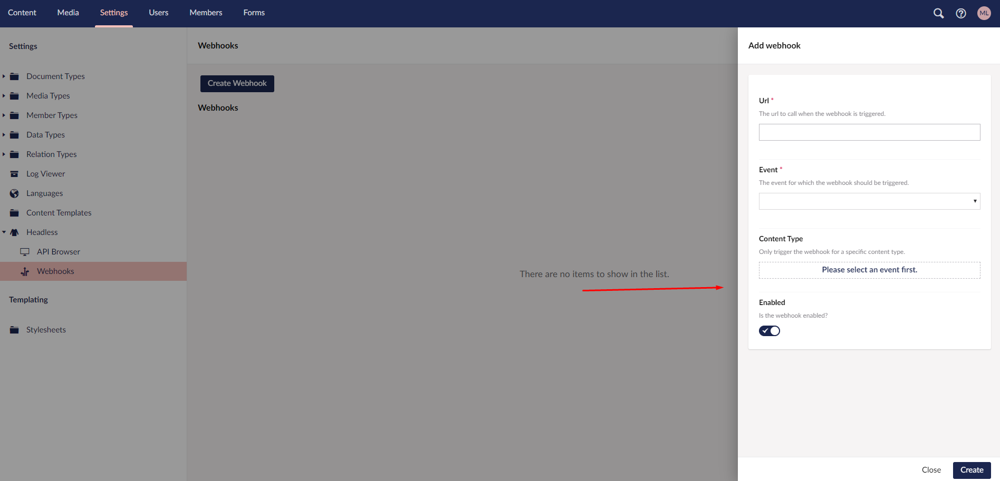

# Webhooks

In this article you can learn more about how to use Webhooks, and how to set them up.

Webhooks from the backoffice works the same way as the webhooks from the portal. It gives you an option to hook into different actions in order to post information about the action elsewhere.

## Usage

An example of when to use webhooks would be if you have a website created with a static page builder.

By adding a webhook to a specific URL and selecting an **Event Trigger**, you can automatically update the website. This is achieved by sending the data from the webhook to the static page builder.

## Setting up a webhook

From the Webhooks menu under the Settings section you can create and manage your webhooks.


Clicking **Create Webhook** will open the creation menu on the right side.



From here you add the URL that the webhook should call and select the **Event** that should trigger the webhook. Lastly, you can choose a Content Type you wish the webhook to trigger on.

Please be aware that selecting the event type is the initial step, and this field is not mandatory.

Once the webhook has been created you can manage it from the list. 


Should you at some point need to temporarily pause the webhook, you can disable them by selecting **Edit** and uncheck **Enabled**.

## Outgoing IPs for webhooks

Webhooks will be fired from either of the two static IPs listed below.

When working with an external service behind a firewall, your service needs to communicate with your Umbraco Cloud project and receive webhook data. This can be done by ensuring that the following IPs are allowed to pass from the firewall

```
20.86.53.156
20.86.53.157
```
If you need to use a Classless Inter-Domain Routing (CIDR) Range for the IPs: `20.86.53.156/31`
