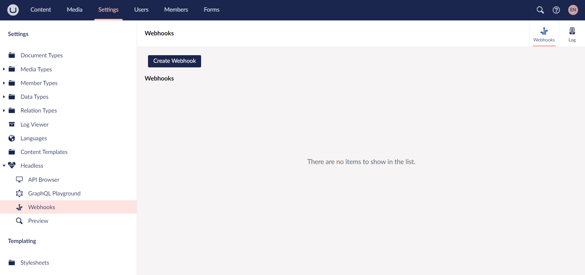
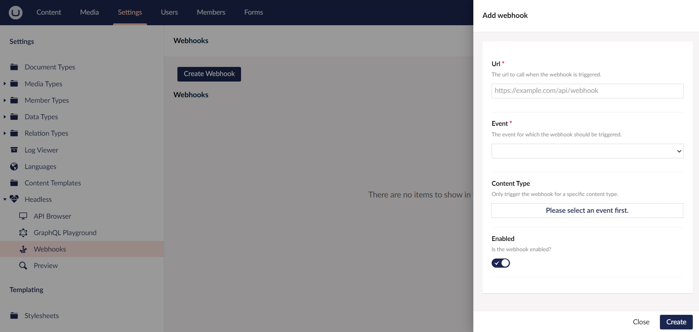
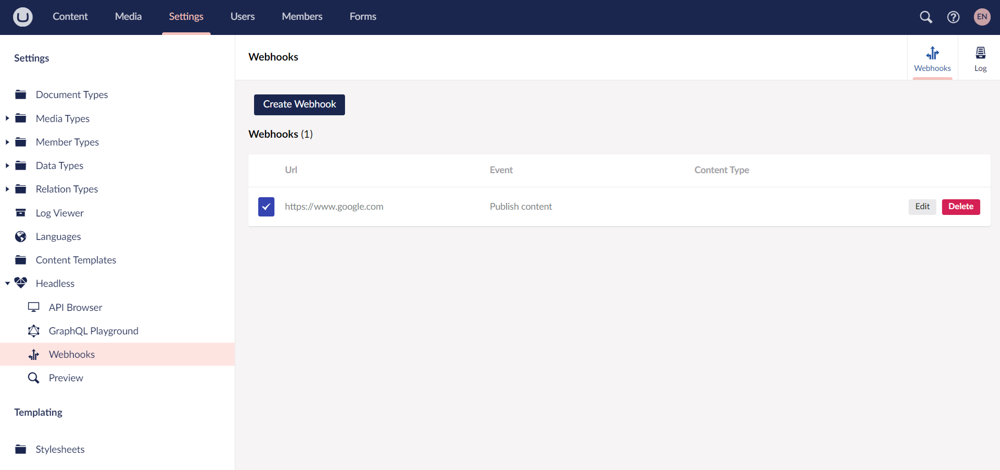

# Webhooks

In this article, you can learn more about how to use Webhooks and set them up.

Webhooks from the backoffice work the same way as the Webhooks from the portal. It gives you an option to hook into different actions to post information about the action elsewhere.

## Usage

An example of when to use webhooks would be if you have a website created with a static page builder.

By adding a webhook to a specific URL and selecting an **Event Trigger**, you can automatically update the website. This is achieved by sending the data from the webhook to the static page builder.

## Setting up a webhook

To set up a Webhook:

1. Go to the **Settings** section.
2. Expand the **Headless** folder in the **Settings** tree.
3. Select **Webhooks**.
    

4. Click **Create Webhook**.
5. The **Add webhook** menu opens on the right side.
    

6. Enter the **URL** that the webhook should call.
7. Select the **Event** for which the webhook should be triggered.
8. Choose a **Content Type** you wish the webhook to be triggered on.
    
    Selecting the Content Type is the initial step. This field is not mandatory.
    
9. Click **Create**.

Once the webhook is created, you can manage it from the list.



To temporarily pause the webhook, disable it by clicking on **Edit** and toggle the **Enabled** field.

## Outgoing IPs for webhooks

Webhooks will be fired from either of the two static IPs listed below.

When working with an external service behind a firewall, your service needs to communicate with your Umbraco Cloud project and receive webhook data. This can be done by ensuring that the following IPs are allowed to pass from the firewall.

```
20.86.53.156
20.86.53.157
```
If you need to use a Classless Inter-Domain Routing (CIDR) Range for the IPs: `20.86.53.156/31`
