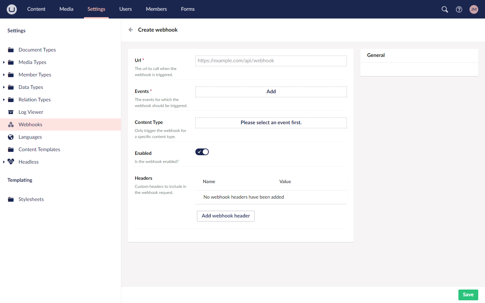

# Webhooks

Webhooks give you the ability to send information about events in Heartcore to external systems. They work by sending an HTTP POST request to a configured endpoint, with information about the event in the request body.

## Uses

Webhooks can keep other systems in-sync with content from Heartcore without having to poll it for changes.

One common use case is building static websites. By adding a webhook, you can inform your chosen static site builder when content changes so that it can re-generate static assets on demand.

## Creating a webhook

Webhooks are managed from a dashboard in the settings section of the backoffice.

1. Go to the **Settings** section.
2. Expand the **Headless** folder in the **Settings** tree.
3. Select **Webhooks**. 
4. Click **Create Webhook**.
5. The **Add webhook** menu opens on the right side.
6. Enter the **URL** that the webhook should call.
7. Select the **Event** for which the webhook should be triggered.
8. Choose a **Content Type** you wish the webhook to be triggered on. 


Selecting the Content Type is the initial step. This field is not mandatory.


9. Click **Create**.

Once the webhook has been created you can manage it from the dashboard.


To temporarily pause/disable the webhook, click on Edit and toggle the Enabled field.

## Webhook Configuraiton

Below is an overview of the webhook configuration options.

*   **Url**

    The URL that Heartcore will send a POST request to when conditions are met.
*   **Events**

    Backoffice or Management API action(s) that will cause the webhook request to be sent.
*   **Content Type** _(optional)_

    Restrict the webhook to firing only if one of these content or media types were affected by one of the selected events.
*   **Enabled**

    Toggle the webhook on or off. While disabled, no requests will be sent.
*   **Headers**

    Configure custom HTTP headers to be sent with the request. May be useful for e.g. identifying the source of a request or for authorization.

## Webhook behaviour specifics

### Retries

When a webhook is triggered, if it fails to be processed by the endpoint Heartcore attempts to re-deliver it up to 9 more times.

* The endpoint returned a non HTTP-compliant response
* The endpoint returned an HTTP response with any status code other than a successful one (HTTP 200 - 299)
* The endpoint failed to respond within a timeout period

### Redelivery

Webhooks are guaranteed to be delivered at least once. I.e. even for a webhook that is delivered successfully, in some situations that hook may be re-delivered.

Your webhook endpoints should thus be capable of handling multiple deliveries. Ideally they are idempotent.

### Unresponsive endpoints

If an endpoint is slow or unresponsive, then webhook delivery may be briefly paused to that endpoint. No messages will be dropped (unless the retry count has been exceeded), but messages will be rescheduled for delivery a short time later. This gives the endpoint room to recover from traffic spikes.

### Outgoing IP addresses

Webhooks will be fired from either of the two static IP addresses listed below.

When your endpoint refers to a service behind a firewall, you may need some additional firewall configuration. You should ensure that HTTP traffic from these addresses is allowed to pass through the firewall:

```
20.86.53.156
20.86.53.157
```

Or if your firewall needs a Classless Inter-Domain Routing (CIDR) Range: `20.86.53.156/31`
