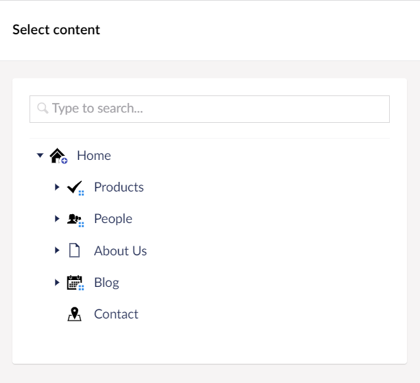

# Content Reviews

Content reviews allows content editors to keep their content up-to-date. **Content reviews** adds a new dashboard to the **Workflow** section. By default, Content reviews are disabled and can be enabled from **Content reviews Settings** in the **Workflow** section.

## Content Reviews Dashboard

Content reviews Dashboard provides an overview of the expired content. The dashboard displays a table containing the following details:

- Page name/Node with the Language variant
- Next review date
- Last reviewed date
- Review period in days
- Review group

Clicking on the content node takes you to the content node in the **Content** section where you can see the Content review message banner.

Clicking on **Mark as reviewed** allows the review group member to mark the content as reviewed. Optionally, the review group member can also set the next review date on the content node.

You can also **Filter** the Dashboard records based on the Node, Group Email, Next review due date, Last reviewed date, and Expired review Status.

Additionally, you can adjust the total number of records displayed on a page.

## Content Reviews Settings

Content reviews Settings tab provides a range of settings for configuring email notifications, review period days, reminder days and so on. Using Content reviews, all content has a default review period.

### General Settings

You can configure the **General** Settings from the **Workflow** section in the **Content reviews** menu. The following settings are available:

- **Enable content reviews** - Enable this setting if you wish to remind users to review their content. By default, this option is disabled.
- **Send notifications** - Provides an option to send email notification to approval groups.
- **Treat saving as a review?** - Determines if a saved content should be treated as review or should the save content require an explicit review.
- **Review period (days)** - Number of days between content reviews.
- **Reminder threshold (days)** - Determines the number of days the review email notifications must be sent before the review date. By default, the number of days is set to 1.

### Content Item and Document Type Reviews

You can configure content reviews for individual content nodes or for all nodes of a given Document Type.

Additionally, you can configure which review group reviews which content nodes or Document Types. The group responsible for reviewing content is derived from the workflow configuration. This means a site with workflow already configured can leverage that permissions model for assigning content review responsibilities. The default workflow configuration can be overridden per content item or Document Type.

#### Content Item Reviews

To add a content item review, follow these steps:

1. Go to the **Workflow** section.
2. Go to the **Settings** tab in the **Content reviews** menu.
3. Click **Add** in the **Content item reviews** section.
  

4. Select **Content node** to add to the Content item reviews section.
  

5. Select the **Language** from the drop-down in the **Add Content item review settings** pane.
6. [Optional] Enable **Exclude from Review** if you wish to exclude this content node from content review. If you enable this setting, skip to step 11.
7. Enter the **Review period** in days.
8. Click **Add** to add the **Review Group**.
9. Select an **approval group**.
10. Click Submit.
    

11. Click Submit.
12. Click **Save Settings**.

To Edit a content item review, click **Edit** and update the settings as per your requirement.

To remove a content item review, click **Remove**.

#### Document Type Reviews

To add a Document Type review, follow these steps:

1. Go to the **Workflow** section.
2. Go to the **Settings** tab in the **Content reviews** menu.
3. Click **Add** in the **Document-type reviews** section.
  

4. Select **Content type** to add to the Document-type reviews section.
  

5. Select the **Language** from the drop-down in the **Add Document-type review settings** pane.
6. [Optional] Enable **Exclude from Review** if you wish to exclude this Document-type from content review. If you enable this setting, skip to step 11.
7. Enter the **Review period** in days.
8. Click **Add** to add the **Review Group**.
9. Select an **approval group**.
10. Click Submit.
    

11. Click Submit.
12. Click **Save Settings**.

To Edit a Document-type review, click **Edit** and update the settings as per your requirement.

To remove a Document-type review, click **Remove**.
