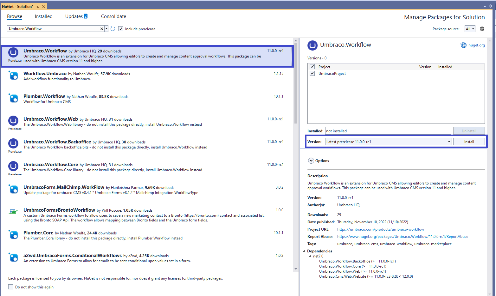
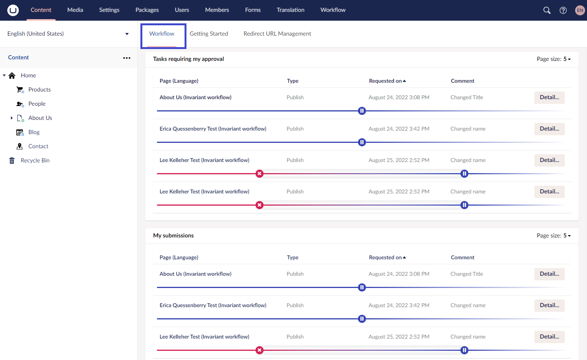
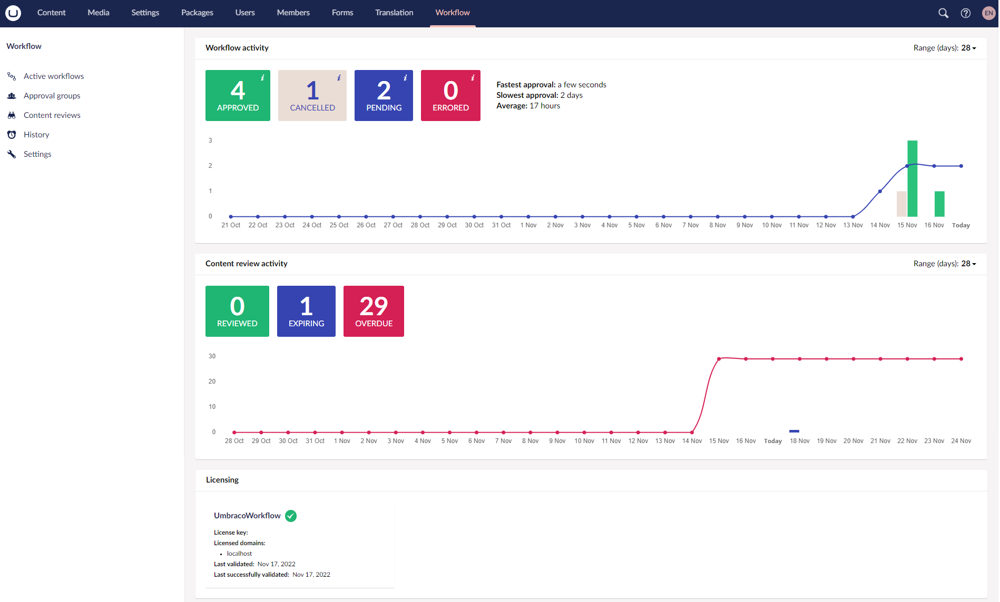

# Installation

In this article, we will cover the steps required to install Umbraco Workflow on your website.

## Prerequisites

* [Umbraco Installation](../umbraco-cms/fundamentals/setup/install/)
* [Microsoft Visual Studio](https://visualstudio.microsoft.com/)

## Video Tutorial


Installing Umbraco Plumber


## Umbraco Workflow Installation

There are different ways to install Umbraco Workflow:

* [.Net CLI Installation](installing-workflow.md#net-cli-installation)
* [Visual Studio Installation](installing-workflow.md#visual-studio-installation)

### .Net CLI Installation

To install the Umbraco Workflow package (Umbraco.Workflow), follow these steps:

1. Run the following command to add a package reference to your Umbraco project:

   ```none
   dotnet add package Umbraco.Workflow --version 11.0.0
   ```

2. Restart the web application using the following command:

   ```none
   dotnet run
   ```

### Visual Studio Installation

To install via Visual Studio, follow these steps:

1. Open your project in Visual Studio.
2. Go to **Tools** -> **NuGet Package Manager** -> **Manage NuGet Packages for Solution...**.
3. Browse for **Umbraco.Workflow**.
4. Select the appropriate version from the Version drop-down depending on the Umbraco version you are using.
5. Click Install. 
6. Once the package is installed, open the `.csproj` file to make sure the package reference is added:

    ```xml
    <ItemGroup>
    <PackageReference Include="Umbraco.Workflow" Version="11.0.0" />
    </ItemGroup>
    ```

## Using Umbraco Workflow

Once the installation is completed, you will see the following in the Umbraco Backoffice:

* A Workflow Dashboard:

  

* A Workflow section:

  
