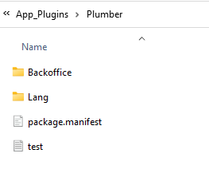

# Licensing

Umbraco Workflow is a licensed product but does not require a purchase to use. New installs are defaulted to a trial license, while the paid license is available for purchase. The trial license introduces some restrictions around advanced features but is otherwise a full-featured workflow platform. The paid license is valid for one top-level domain and all its subdomains.

To impersonate the full license on a local site:

1. Create an empty text file named `test.lic`.
2. Copy the `test.lic` file  into `/App_plugins/UmbracoWorkflow`.

   
3. Set `EnableTestLicense` to `true` in the `appSettings.json` file:

   ```json
   {
    “Umbraco”: {
      …
      “Workflow”: {
       “EnableTestLicense”: true
      }
     }
   }
   ```


The test license is restricted to sites running in a development environment, with a debugger attached (that is hitting F5 in Visual Studio, in Debug mode, will enable the test license).


## Getting an Umbraco Workflow License

If you want to buy an Umbraco Workflow license, reach out to the sales team at **suits@umbraco.com**. Existing Plumber license holders who wish to update to Workflow should contact **suits@umbraco.com**.

To add the license to your site, update the `appSettings.json` file to add the following:

```json
{
  “Umbraco”: {
    “CMS”: {
      “Licenses”: {
        “UmbracoWorkflow”: “YOUR-LICENSE-KEY”
      }
    }
  }
}
```
